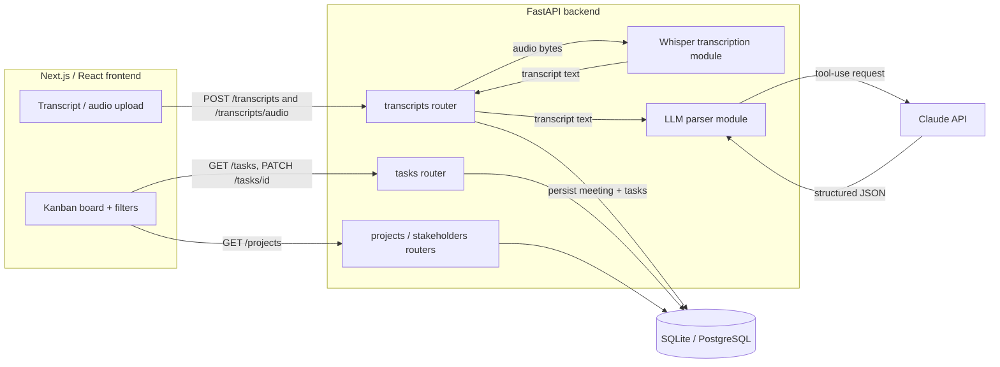
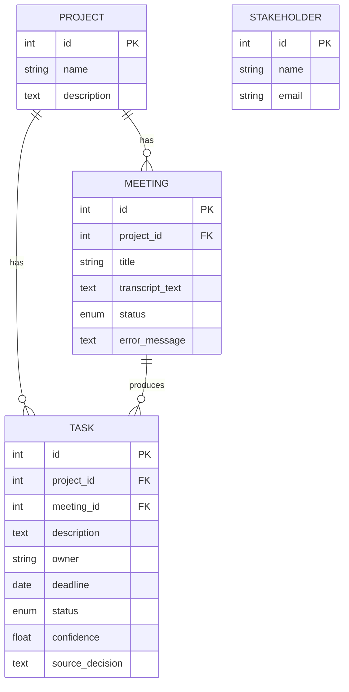

# Architecture

## High-level flow

1. The user submits a meeting via the Next.js frontend — either pasted transcript text or an
   uploaded audio/video file.
2. The frontend calls the FastAPI backend (`POST /transcripts` for text, `POST /transcripts/audio`
   for files).
3. For audio, the backend first runs OpenAI Whisper locally to obtain the transcript text.
4. The backend sends the transcript to Claude with a forced tool-use schema; the response is
   validated into decisions, action items, owners, deadlines, and confidence via Pydantic.
5. The structured data is persisted to the relational database (a `Meeting` plus its `Task` rows).
6. The frontend fetches the task list and renders the Kanban board, with filtering by owner and
   sorting by deadline; status changes are written back with `PATCH /tasks/{id}`.

## Component diagram

## Components

- **Frontend (Next.js/React):** Kanban board, owner filter / deadline sort, transcript-and-audio
  upload UI. Talks to the backend via `src/lib/api.ts`.
- **Backend (FastAPI):**
  - `POST /transcripts` — submit raw transcript text for processing.
  - `POST /transcripts/audio` — submit an audio/video file (Whisper → parse).
  - `GET /transcripts/{id}` — fetch a meeting's status and extracted tasks.
  - `GET /tasks` — list tasks, with `project_id`, `owner`, `status`, `due_before`, `due_after` filters.
  - `PATCH /tasks/{id}` / `DELETE /tasks/{id}` — update status/owner/deadline, or remove.
  - `GET|POST /projects`, `GET|POST /stakeholders`.
  - **LLM parser** (`app/llm/parser.py`) — a reusable, framework-agnostic module: raw text in,
    validated `ExtractionResult` out, via Claude tool-use.
  - **Whisper module** (`app/llm/transcription.py`) — optional, lazily imported so the core app
    runs without the heavy dependency.
- **Database:** PostgreSQL (prod) / SQLite (dev), via SQLAlchemy. Tables: `projects`, `meetings`,
  `stakeholders`, `tasks`.
- **LLM provider:** Claude (Anthropic), structured output through a forced `record_extraction` tool.

## Data model

## Reliability notes

- LLM/API failures during parsing are caught and recorded on the meeting (`status = failed`,
  `error_message`) rather than crashing the request, so the client always gets a response.
- The audio endpoint degrades gracefully: if Whisper isn't installed it returns `503` with an
  actionable message instead of failing at import time.
