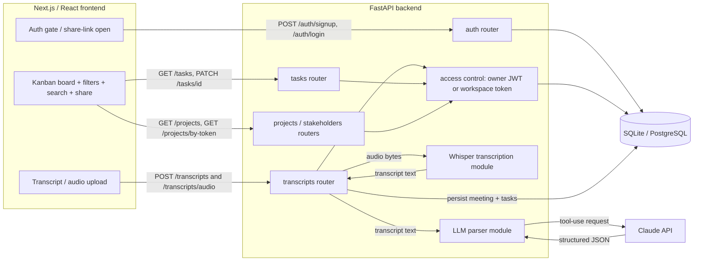
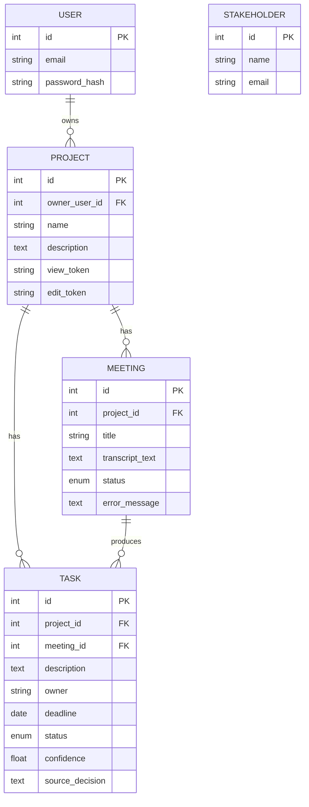

# Architecture

## High-level flow

1. The user authenticates via the Next.js frontend — sign in, create an account, or continue as
   a guest. Logged-in users carry a JWT; guests and link recipients carry a board's capability
   token. Either is attached to subsequent requests.
2. The user submits a meeting — pasted transcript text or an uploaded audio/video file.
3. The frontend calls the FastAPI backend (`POST /transcripts` for text, `POST /transcripts/audio`
   for files). Write endpoints require edit access to the target board.
4. For audio, the backend first runs Whisper (a hosted Whisper API by default, or a local model)
   to obtain the transcript text.
5. The backend sends the transcript to Claude with a forced tool-use schema; the response is
   validated into decisions, action items, owners, deadlines, and confidence via Pydantic.
6. The structured data is persisted to the relational database (a `Meeting` plus its `Task` rows).
7. The frontend fetches the task list and renders the Kanban board, with search, owner filtering,
   and deadline sorting; status changes are written back with `PATCH /tasks/{id}`.

## Component diagram

## Components

- **Frontend (Next.js/React):** auth gate (sign in / create account / continue as guest), Kanban
  board, owner filter / deadline sort / text search, transcript-and-audio upload, and a share
  dialog exposing view/edit links. A small session layer persists the account token and guest
  boards in `localStorage`. Talks to the backend via `src/lib/api.ts`, which attaches the
  `Authorization` bearer and `X-Workspace-Token` headers.
- **Backend (FastAPI):**
  - `POST /auth/signup` (with optional guest-board claim), `POST /auth/login`, `GET /auth/me`.
  - `GET|POST /projects`, `GET /projects/by-token/{token}` (open a share link),
    `PATCH|DELETE /projects/{id}`.
  - `POST /transcripts`, `POST /transcripts/audio`, `GET /transcripts/{id}`,
    `PATCH /transcripts/{id}` (rename a meeting; reflected on its tasks).
  - `GET|POST /tasks`, `PATCH /tasks/{id}`, `DELETE /tasks/{id}`. `GET /tasks` filters by
    `project_id`, `owner`, `status`, `due_before`, `due_after`; with no `project_id` an
    authenticated user gets tasks across all boards they own.
  - `GET|POST /stakeholders`.
  - **Auth & access control** (`app/auth.py`) — bcrypt password hashing, JWT issue/verify, and
    `project_access_level()` which resolves a request to `edit` / `view` / no-access from the
    bearer user (owner) or the `X-Workspace-Token` (edit/view token).
  - **LLM parser** (`app/llm/parser.py`) — a reusable, framework-agnostic module: raw text in,
    validated `ExtractionResult` out, via Claude tool-use.
  - **Whisper module** (`app/llm/transcription.py`) — optional, lazily imported; prefers a hosted
    Whisper API and falls back to a local model, so the core app runs without the heavy dependency.
- **Database:** PostgreSQL (prod) / SQLite (dev), via SQLAlchemy. Tables: `users`, `projects`,
  `meetings`, `stakeholders`, `tasks`.
- **LLM provider:** Claude (Anthropic), structured output through a forced `record_extraction` tool.

## Access model

- A project is owned by a user (`owner_user_id`) or unowned (guest-created).
- Each project has two permanent capability tokens: `view_token` (read-only) and `edit_token`
  (read/write). A request gains access by being the owner (JWT) **or** presenting a matching token.
- `ProjectOut` returns the `edit_token` only to edit-level callers, so a view link never leaks
  write access. On sign-up, a guest's `edit_token`s can be supplied to claim those boards.
- Sharing is asynchronous (no live sync); concurrent edits are last-write-wins.

## Data model

A task exposes its source meeting's title (`meeting_title`) for display; manually-added tasks have
no `meeting_id` and carry full confidence.

## Reliability notes

- LLM/API failures during parsing are caught and recorded on the meeting (`status = failed`,
  `error_message`) rather than crashing the request, so the client always gets a response.
- The audio endpoint degrades gracefully: if no Whisper backend is configured it returns `503`
  with an actionable message instead of failing at import time.
- The schema is created on startup via `create_all`, which never alters existing tables; after a
  schema change, `python -m app.reset_db` rebuilds and re-seeds the database.
