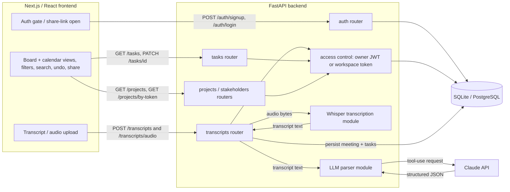
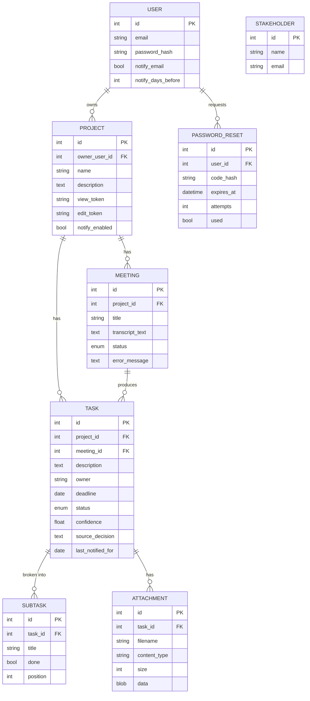

# Architecture

## High-level flow

1. The user authenticates via the Next.js frontend — sign in, create an account, or continue as
   a guest. Logged-in users carry a JWT; guests and link recipients carry a board's capability
   token. Either is attached to subsequent requests.
2. The user submits a meeting — pasted transcript text or an uploaded audio/video file.
3. The frontend calls the FastAPI backend (`POST /transcripts` for text, `POST /transcripts/audio`
   for files). Write endpoints require edit access to the target board.
4. For audio, the backend first runs Whisper (a hosted Whisper API by default, or a local model)
   to obtain the transcript text.
5. The backend sends the transcript to Claude with a forced tool-use schema; the response is
   validated into decisions, action items, owners, deadlines, and confidence via Pydantic.
6. The structured data is persisted to the relational database (a `Meeting` plus its `Task` rows).
7. The frontend fetches the task list and renders it two ways — a **Kanban board** (drag-and-drop
   status changes) and a **month calendar** (tasks plotted by deadline, drag-to-reschedule) — both
   with search and owner filtering. Edits are written back with `PATCH /tasks/{id}`; deletes return
   a snapshot so an **Undo** action (button + ⌘Z/Ctrl+Z) can restore via `POST /tasks/restore`.

## Component diagram

## Components

- **Frontend (Next.js/React):** auth gate (sign in / create account / continue as guest), a
  **Kanban board** and a **month calendar** view (toggle), owner filter / deadline sort / text
  search, an **undo** stack (button + ⌘Z/Ctrl+Z) over status/edit/reschedule/delete actions,
  transcript-and-audio upload, and a share dialog exposing view/edit links. A small session layer
  persists the account token and guest boards in `localStorage`. Talks to the backend via
  `src/lib/api.ts`, which attaches the `Authorization` bearer and `X-Workspace-Token` headers.
- **Backend (FastAPI):**
  - `POST /auth/signup` (with optional guest-board claim), `POST /auth/login`, `GET /auth/me`,
    `POST /auth/password` (change password), `DELETE /auth/me` (delete account; owned boards are
    orphaned to guest boards), and `POST /auth/forgot-password` + `POST /auth/reset-password`
    (emailed 6-digit reset code).
  - `GET|POST /projects`, `GET /projects/by-token/{token}` (open a share link),
    `PATCH|DELETE /projects/{id}`.
  - `POST /transcripts`, `POST /transcripts/audio`, `GET /transcripts/{id}`,
    `PATCH /transcripts/{id}` (rename a meeting; reflected on its tasks).
  - `GET|POST /tasks`, `PATCH /tasks/{id}`, `DELETE /tasks/{id}` (returns a snapshot for undo),
    `POST /tasks/restore` (recreate a deleted task with its original id). `GET /tasks` filters by
    `project_id`, `owner`, `status`, `due_before`, `due_after`; with no `project_id` an
    authenticated user gets tasks across all boards they own.
  - `GET|POST /stakeholders`.
  - `PATCH /auth/notifications` (set deadline-reminder preferences), `POST /auth/notifications/test`
    (send a one-off preview digest).
  - **Auth & access control** (`app/auth.py`) — bcrypt password hashing, JWT issue/verify, and
    `project_access_level()` which resolves a request to `edit` / `view` / no-access from the
    bearer user (owner) or the `X-Workspace-Token` (edit/view token).
  - **Email sender** (`app/email.py`) — sends password-reset codes and deadline reminders. Prefers
    Brevo's HTTPS API (`BREVO_API_KEY`) so it works on hosts that block outbound SMTP (e.g. Render's
    free tier), falls back to SMTP, and otherwise logs the message. Reset emails are dispatched via
    FastAPI background tasks so a slow send never holds the request open.
  - **Deadline reminders** (`app/notifications.py`) — opt-in (off by default) per account, with
    per-project opt-in selection and a configurable "days before" threshold. `GET /internal/notify-due-tasks`
    (shared-secret protected) runs the daily check over HTTP, for a free external scheduler to
    call once a day — Render has no built-in free scheduler and Render Cron Jobs are a paid
    add-on. See "Deadline reminders" below.
  - **LLM parser** (`app/llm/parser.py`) — a reusable, framework-agnostic module: raw text in,
    validated `ExtractionResult` out, via Claude tool-use.
  - **Subtask generator** (`app/llm/subtasks.py`) — breaks a single task into an ordered checklist
    via Claude tool-use, either from the task's own details or from user-supplied instructions.
  - **Whisper module** (`app/llm/transcription.py`) — optional, lazily imported; prefers a hosted
    Whisper API and falls back to a local model, so the core app runs without the heavy dependency.
- **Database:** PostgreSQL (prod) / SQLite (dev), via SQLAlchemy. Tables: `users`, `projects`,
  `meetings`, `stakeholders`, `tasks`, `subtasks`, `attachments`, `password_resets`. Attachment
  bytes are stored in the `attachments` row (the deploy target has an ephemeral filesystem and no
  object storage), size-capped in the API. The engine is created with `pool_pre_ping` (and a 5-min
  `pool_recycle`) because serverless Postgres (Neon) drops idle connections — without it, the first
  request after the free backend wakes from sleep fails with "SSL connection has been closed
  unexpectedly"; pre-ping validates and reconnects transparently instead.
- **LLM provider:** Claude (Anthropic), structured output through a forced `record_extraction` tool.

## Access model

- A project is owned by a user (`owner_user_id`) or unowned (guest-created).
- Each project has two permanent capability tokens: `view_token` (read-only) and `edit_token`
  (read/write). A request gains access by being the owner (JWT) **or** presenting a matching token.
- `ProjectOut` returns the `edit_token` only to edit-level callers, so a view link never leaks
  write access. On sign-up, a guest's `edit_token`s can be supplied to claim those boards.
- Sharing is asynchronous (no live sync); concurrent edits are last-write-wins.

## Deadline reminders

- Opt-in per account (`User.notify_email`, default off) with a configurable
  `notify_days_before`, plus per-project opt-in (`Project.notify_enabled`, default off): a board
  is reminded only when both the account flag and that board's flag are on. The user picks which
  boards remind them from the project checklist in Account settings.
- `app/notifications.py` finds tasks inside their reminder window — from `notify_days_before`
  days out through one day past the deadline (a one-time overdue nudge, not a repeat) — and
  emails each affected account holder a single digest covering every newly-due task across their
  reminder-enabled projects.
- Idempotency: `Task.last_notified_for` records the deadline last notified for, so re-running the
  same day, or after the deadline, never double-sends. Rescheduling a task's deadline clears the
  match, re-opening the window.
- The window is date-based, so "today" is computed in `REMINDER_TIMEZONE` (IANA zone, default UTC).
  The server clock is UTC, which would otherwise put a reminder a day off for users elsewhere — a
  task due "Jun 24" with a one-day lead enters its window at 08:00 SGT on Jun 23 under plain UTC.
- Two ways to trigger a pass: `python -m app.notify_due_tasks` (a CLI script, useful for a local
  cron entry or manual runs) and `GET /internal/notify-due-tasks` (the same logic over HTTP,
  guarded by a shared secret `CRON_SECRET` instead of a user session). The latter is meant for a
  free external scheduler (e.g. cron-job.org) hitting it once a day — Render has no built-in free
  scheduler and Render Cron Jobs are a paid add-on, so this avoids that cost entirely.
- `POST /auth/notifications/test` runs the same logic on demand for one signed-in user, useful for
  confirming the email channel works without waiting for the daily trigger.

## Data model

A task exposes its source meeting's title (`meeting_title`) for display; manually-added tasks have
no `meeting_id` and carry full confidence.

## Reliability notes

- LLM/API failures during parsing are caught and recorded on the meeting (`status = failed`,
  `error_message`) rather than crashing the request, so the client always gets a response.
- The audio endpoint degrades gracefully: if no Whisper backend is configured it returns `503`
  with an actionable message instead of failing at import time.
- The schema is created on startup via `create_all`, which adds missing tables but never alters
  existing ones. New tables (e.g. `subtasks`, `attachments`) appear automatically; a new column on
  an existing table needs an additive migration (`app/migrate_add_notifications.py`,
  `app/migrate_reminder_optin.py`). `python -m app.reset_db` rebuilds and re-seeds from scratch.
